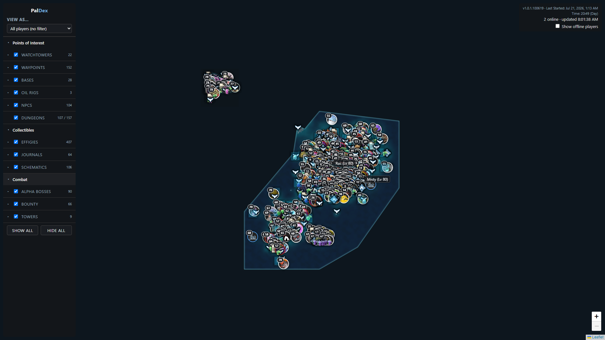
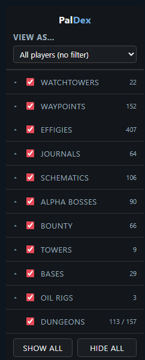
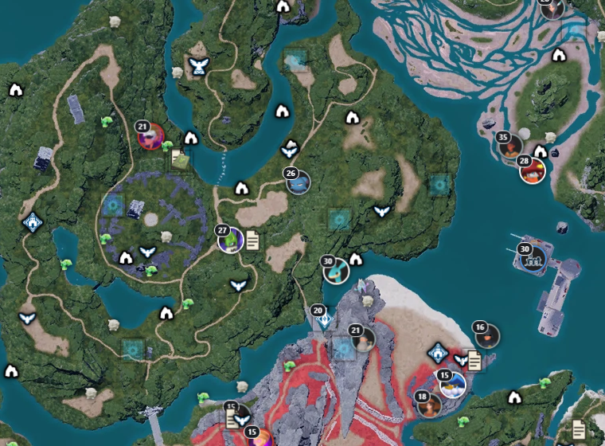

# PalDex

A live, self-hosted map for a Palworld dedicated server — player positions,
collectibles, bosses, and world state, all read straight from the server's
own save files and the game's own assets (not scraped from a wiki).



## What it shows

| Layer | What it tracks | Live per-player state? |
|---|---|---|
| **Players** | Live position, level, HP, hunger, online/offline (via RCON), last-online time | — |
| **Effigies** (Relics) | 407 collectible statues, grouped by tier | ✅ per-player collected |
| **Alpha Bosses** | 90 field-boss spawns, name/species/element | ✅ per-player defeated |
| **Bounty** | 66 named human NPC bosses (bandit/raider/syndicate leaders) | ✅ per-player defeated |
| **Challenge Towers** | The 9 "GYM" boss-rush towers | ✅ per-player defeated |
| **Oil Rigs** | The 3 raid-zone POIs | world-shared (no per-player state exists) |
| **Watchtowers / Waypoints** | 22 climbable watchtowers + 152 fast-travel points | ✅ per-player unlocked |
| **Journals** | 64 lore pickups (Castaway's Journal + NPC Diaries) | ✅ per-player read |
| **Schematics** | 106 blueprint pickups | ✅ per-player collected |
| **Guild Bases** | Player-built bases, grouped by guild | live, world-shared |
| **Dungeons** | Open-world dungeon entrances — **only the ones currently spawned/enterable are shown**, with a live `active / total` count and a despawn ETA | live, world-shared |

Selecting a player from **View As...** filters every checklist to what *that*
player has actually collected/defeated/unlocked, and pans the map to their
current position.




<br clear="left" />

## How it works

- **`backend/remote.py`** pulls `Level.sav` and every player's `.sav` from
  the AMP game server over SSH (sudo-scoped `rsync`/SFTP), on a 30-second
  refresh loop.
- **`backend/parse.py`** decodes the save files using
  [`deafdudecomputers/PalworldSaveTools`](https://github.com/deafdudecomputers/PalworldSaveTools)
  (the PyPI `palworld-save-tools` package doesn't support the 1.0 release's
  save format) and extracts everything live: player state, per-player
  collection/defeat/unlock flags, guild bases, and — as of the Dungeons
  feature — which dungeon entrances currently have a spawned instance.
- **`extractor/PalExtract`** is a one-off C# console app
  ([CUE4Parse](https://github.com/FabianFG/CUE4Parse)) that reads the
  *static* data (positions, names, icons, element types, map textures)
  directly out of the game's own `.uasset`/World Partition files. This runs
  once per game patch on a Windows box with the game installed, not at
  request time — its output is baked into the Docker image as
  `data/*_static.json` + `frontend/assets/`.
- **`backend/server.py`** is a Flask app that serves the static + live data
  as JSON (`/api/players`, `/api/relics`, `/api/dungeons`, etc.).
- **`frontend/index.html`** is a single-page Leaflet (`CRS.Simple`) map,
  rendered against the game's own map texture, polling those endpoints —
  no build step, no framework.

Nothing here is guessed: every mechanic (effigy collection flags, boss
kill-tracking keys, dungeon active-state, coordinate transforms, etc.) was
reverse-engineered directly from a real save file or the game's own data
tables, with dead ends recorded so they don't get re-attempted. The full
investigation log — including the handful of things that *are* cross-checked
against public wikis (e.g. the elemental type-effectiveness chart, which
isn't stored as game data) — lives in [`NOTES.md`](NOTES.md).

## Tech stack

| | |
|---|---|
| Backend | Python 3.13, [Flask](https://github.com/pallets/flask) |
| Save parsing | [`palsav-flex` / `palooz`](https://github.com/deafdudecomputers/PalworldSaveTools) (Oodle decompression) |
| Frontend | [Leaflet.js](https://github.com/Leaflet/Leaflet), vanilla JS, no build step |
| Extractor | C#, .NET, [CUE4Parse](https://github.com/FabianFG/CUE4Parse) |
| Deployment | Docker, Portainer (git-repository stack) |

## Acknowledgments

This project reads game data directly rather than scraping a wiki, which
wouldn't be possible without these open-source projects:

- **[deafdudecomputers/PalworldSaveTools](https://github.com/deafdudecomputers/PalworldSaveTools)**
  — save file decoding (`palsav-flex`, `palooz`), including Oodle/`PlM`
  decompression for the 1.0 game release. Does all the heavy lifting behind
  every "live" layer on the map.
- **[FabianFG/CUE4Parse](https://github.com/FabianFG/CUE4Parse)** +
  **[CUE4Parse-Conversion](https://github.com/FabianFG/CUE4Parse-Conversion)**
  — reads Unreal Engine assets (`.uasset`/World Partition/DataTables)
  directly, powering `extractor/PalExtract`'s extraction of every static
  position, name, icon, and map texture.
- **[SixLabors.ImageSharp](https://github.com/SixLabors/ImageSharp)** — image
  resizing for the extracted icon set (a CUE4Parse-Conversion dependency,
  used directly for downscaling Journal icons).
- **[PalworldModding/UsefulFiles](https://github.com/PalworldModding/UsefulFiles)**
  — actively-maintained CUE4Parse mapping files for the current game
  version.
- **[palworldlol/palworld-coord](https://github.com/palworldlol/palworld-coord)**
  — the in-game-HUD-coordinate conversion formula used to validate several
  extracted positions (see `NOTES.md`).
- **[Leaflet](https://github.com/Leaflet/Leaflet)** — the map renderer this
  whole frontend is built on.

## Running locally

This is the Windows dev-box flow (uses the Bitvise SSH Client for the AMP
pull — see `backend/remote.py`). For Linux, including a bare LXC/VM with no
Docker, use [`deploy/bare-metal.md`](deploy/bare-metal.md) instead — the
setup differs enough (OpenSSH key provisioning, an env var with no default
outside a container, a Python import gotcha in how you invoke `server.py`)
that it's not just a `pip install` away.

```
cd backend
python -m venv ../.venv
../.venv/Scripts/pip install -r requirements.txt
# provide RCON_PASSWORD / AMP_HOST / AMP_USER / AMP_SAVE_ROOT / AMP_WORLD_GUID
# via env vars, or a local backend/secrets.py (gitignored)
python server.py
```

Then open `http://localhost:5151`.

**Whichever platform you're on, always run `server.py` directly as a
script** (`python server.py` / `python backend/server.py`), never as a
module (`python -m backend.server`) or via a WSGI target
(`backend.server:app`). The config loader (`backend/config.py`) resolves
`backend/secrets.py` via a plain `import secrets` — that only finds this
project's file if `backend/` is the directory Python was launched from
(true for `python server.py`/`python backend/server.py`, false for `-m`
invocation). Get it wrong and Python silently imports its own **standard
library** `secrets` module instead, which has no `RCON_PASSWORD` attribute —
producing a "not set" error that looks like a missing-config problem, not
an import-shadowing one.

## Deploying

Two supported paths:

- **Docker/Portainer** — see [`deploy/README.md`](deploy/README.md) (required
  env vars, SSH key provisioning, and gotchas from the first real deploy).
- **Bare Linux LXC/VM, no Docker** — see
  [`deploy/bare-metal.md`](deploy/bare-metal.md) (same config, plus the
  container-only defaults and import gotchas above that don't apply once
  there's no container around it).

## Project layout

```
backend/            Flask app, save-file parsing, live refresh loop
frontend/            Leaflet map (index.html + assets/)
extractor/PalExtract  One-off CUE4Parse extractor for static game data
data/                 Static extracted JSON (+ gitignored live-refreshed data)
deploy/               Docker/Portainer deployment docs and config
NOTES.md              Full reverse-engineering investigation log
```

## License

[MIT](LICENSE)
